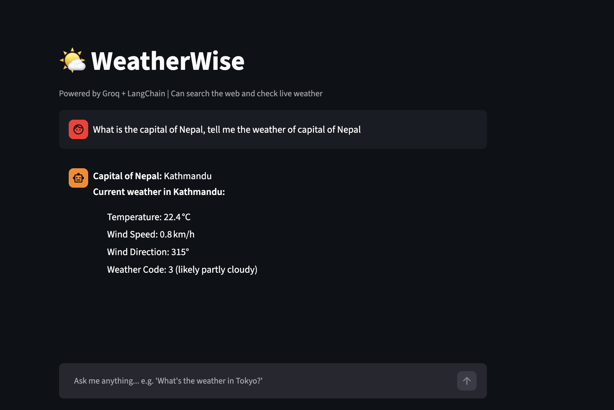

# 🌤️ WeatherWise — AI Research Agent

> A conversational AI agent that answers questions using real-time web search and live weather data, built with LangGraph's ReAct architecture and deployed on Streamlit Cloud.



## 🔗 Live Demo

[**Try it on Streamlit →**](https://ai-weather-research-agent-project-8oyqdavd46widpq5vrunlg.streamlit.app/)

---

## What It Does

WeatherWise is an autonomous AI agent that decides which tools to use — and in what order — to answer your questions. Ask it something like *"What's the capital of Nepal and what's the weather there?"* and it will:

1. Search the web to find the answer
2. Call the weather API with the result
3. Return a combined, natural-language response

---

## Tech Stack

| Layer | Technology |
|---|---|
| LLM | [Groq](https://groq.com) — ultra-fast inference |
| Agent Framework | [LangGraph](https://github.com/langchain-ai/langgraph) — ReAct agent loop |
| Tools | DuckDuckGo Search, Open-Meteo Weather API |
| Frontend | [Streamlit](https://streamlit.io) |
| Language | Python 3.11 |

---

## Architecture

```
User Query
    │
    ▼
ReAct Agent (LangGraph)
    ├── search_web()   → DuckDuckGo Search
    └── get_weather()  → Open-Meteo API (geocoding + forecast)
    │
    ▼
Natural Language Response
```

The agent uses the **ReAct (Reasoning + Acting)** pattern — it reasons about which tool to call, calls it, observes the result, and repeats until it can answer the query. This enables multi-step tool chaining without hardcoded logic.

---

## Features

- **Multi-step tool chaining** — resolves intermediate answers (e.g. capital → weather) automatically
- **Live weather data** — temperature, wind speed, and conditions via Open-Meteo (no API key needed)
- **Web search** — DuckDuckGo search for current information on any topic
- **Graceful error handling** — user-friendly messages for rate limits, timeouts, and API failures
- **Persistent chat history** — conversation context maintained within a session

---

## Run Locally

```bash
git clone https://github.com/Nishan8912/ai-weather-research-agent-project
cd ai-weather-research-agent-project
pip install -r requirements.txt
```

Create a `.env` file:
```
GROQ_API_KEY=your_groq_api_key
```

```bash
streamlit run app.py
```

---

## Project Structure

```
├── app.py              # Streamlit UI
├── agent.py            # LangGraph ReAct agent setup
├── tools/
│   ├── search.py       # DuckDuckGo web search tool
│   └── weather.py      # Open-Meteo weather tool
├── requirements.txt
└── runtime.txt         # Python 3.11 for Streamlit Cloud
```
